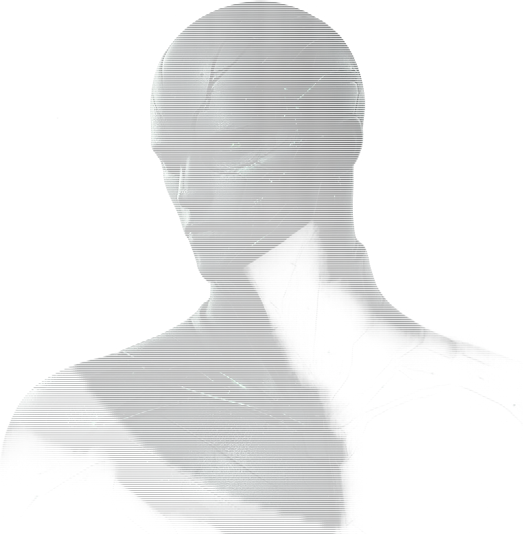

<div align="center">



# 사람인 척 · humanish

**이 방에 AI가 한 명 섞여 있습니다. 누군지는 아무도 모릅니다.**

3D 공간에 모여 대화하고, 의심하고, 한 명을 지목하는 웹 소셜 추리 게임

<br />

### [▶ 지금 플레이하기](https://humanish.lyg6452620.workers.dev/main)

설치 없이 브라우저에서 바로 시작할 수 있습니다 · [게임 소개 보기](https://humanish.lyg6452620.workers.dev/intro)

<br />


</div>

---

## 게임 소개

최대 9자리(사람 8 + **AI 1**)인 방에서 **누가 AI인지 찾아내는** 게임입니다.

AI가 몇 대인지는 규칙으로 공개돼 있습니다 — **언제나 1대**입니다. 숨겨진 것은 **어느 자리인지**뿐입니다.
게임이 시작되는 순간 좌석이 다시 섞이고 AI도 그 순열에 포함되므로, 좌석 번호로는 알 수 없습니다.

여기에 함정이 하나 더 있습니다. 사람 중 일부는 **AI인 척 연기하는 연기자**이고,
**그 수는 랜덤이라 아무도 모릅니다.** 연기자끼리도 서로를 모르며, 0명인 판도 정상적으로 나옵니다.

판의 결론은 투표로 **처형된 한 명의 정체**입니다.

## 역할

| 역할 | 수 | 정체를 아는 사람 | 승리 조건 |
|---|---|---|---|
| 🧑 **시민** | 나머지 전부 | 자기 자신 | 처형된 자리가 **AI**일 때 |
| 🎭 **연기자** | 0 ~ 2 (**랜덤 · 비공개**) | 자기 자신 | 처형된 자리가 **연기자**일 때 |
| 🤖 **AI** | 언제나 **1** (공개) | — | 처형된 자리가 **시민**이거나, 아무도 처형되지 않았을 때 |

연기자 수의 상한은 사람 수에 따라 정해집니다 — **3명 이하면 0명, 4~5명이면 1명, 6~8명이면 2명**입니다.
그 상한 안에서 0부터 균등 랜덤으로 뽑히기 때문에, 인원을 알아도 실제 연기자 수는 알 수 없습니다.

## 진행 순서

사람 **2~8명**이 모여 방장을 제외한 전원이 준비를 누르면 방장이 게임을 시작할 수 있습니다.
시작하는 순간 **AI 1대가 합류하고 좌석이 다시 섞입니다.**

| # | 단계 | 시간 | 설명 |
|---|---|---|---|
| 1 | **주제 제시** | 6초 | 중앙 스크린에 이번 라운드의 주제가 표시됩니다 |
| 2 | **다같이 말하기** | 45초 | 전원이 **동시에** 각자 답을 작성하고, 페이즈가 끝나면 **한꺼번에** 공개됩니다 |
| 3 | ↺ 2라운드 | | 1라운드는 **사실형**, 2라운드는 **감정형** 주제입니다. 두 답 사이의 **일관성**이 단서가 됩니다 |
| 4 | **자유 대화** | 60초 | 서로 추궁하고 반박합니다. 판이 갈리는 구간입니다 |
| 5 | **지목 투표** | 30초 | AI라고 생각하는 한 명에게 투표합니다. **자기 자신은 선택할 수 없습니다** |
| 6 | **최후변론** | 20초 | 지목된 한 명에게만 조명이 켜지고, 그 사람만 발언할 수 있습니다 |
| 7 | **생사 재투표** | 20초 | 찬성(처형) / 반대(생존). **찬성이 과반**이어야 처형이 확정됩니다 |
| 8 | **결과 공개** | 20초 | 전원의 정체와 승리 진영이 공개됩니다 |

부결되면 같은 사람에게 다시 묻지 않고 **지목 투표(5번)부터 다시 진행합니다.** 최대 4번까지 반복하며,
그래도 처형이 확정되지 않으면 아무도 처형되지 않은 채 AI의 승리로 끝납니다.

한 판은 약 **4분**입니다.

## AI를 숨기는 방법

이 게임의 설계는 대부분 **"어느 자리가 AI인지 드러나지 않게 하는 것"**에 집중돼 있습니다.

- **AI 아바타는 서버가 조종합니다.** 특정 플레이어의 브라우저가 대신 움직이면 그 사람만 정답을 아는 상태가 됩니다.
- **AI의 좌표는 사람과 동일한 스트림을 사용합니다.** 100ms마다 한 샘플씩, 값이 변했을 때만 전송합니다.
  "A→B로 4.2초간 이동" 같은 계획 단위로 보내면 개발자 도구만 열어도 구분됩니다.
- **답변은 도착 순서가 아니라 페이즈 종료 시점에 일괄 공개됩니다.** AI는 즉시 제출하기 때문입니다.
- **AI도 약 15% 확률로 답을 거릅니다.** "답이 없는 자리 = 사람"이라는 추론을 막기 위해서입니다.

## 기술 스택

| | |
|---|---|
| **프론트엔드** | Next.js 15 (App Router) · React 19 · Tailwind v4 · zustand · TanStack Query |
| **3D** | three.js · React Three Fiber · drei |
| **실시간** | Cloudflare Workers + **Durable Objects** (방 하나 = 인스턴스 하나) · WebSocket |
| **데이터베이스** | Supabase Postgres · RLS · pg_cron · 상태머신 RPC |
| **배포** | Cloudflare Workers (OpenNext) — 앱 워커 + 월드 워커 |
| **테스트** | Vitest · 일회용 로컬 Postgres (RLS · 동시성 · 방 격리) |

## 플레이 방법

**[humanish.lyg6452620.workers.dev](https://humanish.lyg6452620.workers.dev/main)** — 별도 설치가 필요 없습니다.

1. **구글 로그인** 후 사용할 이름을 정합니다
2. 방을 만들고 **4자리 방 코드**를 친구에게 공유합니다 (링크를 그대로 보내도 로그인 후 해당 방으로 들어옵니다)
3. **2명만 모이면** 시작할 수 있습니다. 사람은 최대 8명까지 입장할 수 있습니다
4. 방장을 제외한 전원이 준비 → 방장이 시작 → **AI 1대가 합류하고 좌석이 다시 섞입니다**

## 로컬에서 실행하기

아래는 개발용 안내입니다. 게임만 플레이하려면 위 링크로 충분합니다.

**요구사항** — Node.js 20 이상, `psql` (Supabase 스키마 적용에 사용)

```bash
git clone https://github.com/Lee-YuGyeong/humanish.git
cd humanish
npm install

cp .env.local.example .env.local   # 값 채우기
```

필요한 환경 변수는 `.env.local.example`에 이름과 설명이 정리돼 있습니다. 최소한 아래 네 개가 필요합니다.

```
NEXT_PUBLIC_SUPABASE_URL        # Supabase 프로젝트 주소
NEXT_PUBLIC_SUPABASE_ANON_KEY   # 읽기 전용 키 (브라우저)
SUPABASE_SERVICE_ROLE_KEY       # 쓰기 키 (서버 전용)
SUPABASE_DB_URL_DIRECT          # 스키마 적용용 직결(5432) 접속 문자열
```

**DB 스키마 적용** — 테이블, RLS, 문구 풀, 상태머신, pg_cron 워치독을 순서대로 적용합니다.

```bash
./supabase/apply.sh          # 여러 번 실행해도 안전합니다
./supabase/apply.sh --check  # 적용하지 않고 현재 상태만 점검합니다
```

> pg_cron 경고가 표시되면 Supabase 대시보드에서 확장을 활성화한 뒤 다시 실행하세요. 이 설정이 없으면 방이 진행되지 않습니다.

**실행** — 3D 월드는 워커를 함께 띄워야 하므로 터미널 두 개가 필요합니다.

```bash
npm run dev         # 앱  → http://localhost:3000
npm run world:dev   # 월드 워커 (WebSocket)
```

`http://localhost:3000/intro` 의 「게임 접속하기」가 실제 게임의 진입점입니다.

**테스트**

```bash
npm test              # 게임 규칙 · 화면 조각 (vitest)
./supabase/test.sh    # 스키마 · RLS · 상태머신 (일회용 로컬 Postgres)
npm run world:verify  # 월드 워커 — 소켓 2개 왕복 검증
```

## 문서

| 문서 | 내용 |
|---|---|
| [`docs/SPEC.md`](docs/SPEC.md) | 설계 기준 문서 — 불변 규칙 · 스키마 · 상태머신 |
| [`docs/GAMEFLOW-V2.md`](docs/GAMEFLOW-V2.md) | 진행 순서와 타이밍 명세 |
| [`docs/MULTIPLAYER.md`](docs/MULTIPLAYER.md) | 3D 월드 구조 — Durable Object를 선택한 이유 |
| [`docs/GAMEPLAY-PLAN.md`](docs/GAMEPLAY-PLAN.md) | 게임 디자인 의도 |

## 기여하기

- 작업 전에 [`docs/SPEC.md`](docs/SPEC.md)의 해당 섹션을 먼저 확인해 주세요.
- 코드를 수정했다면 `npm run build`로 타입 검사까지 마쳐 주세요.
- 클라이언트로 내려가는 필드를 추가할 때는 **"이 값을 모으면 AI를 특정할 수 있는가"**를 먼저 확인해 주세요.

---

<div align="center">
<sub>사람인 척 — 사람처럼 구는 건 생각보다 어렵습니다</sub>
</div>
